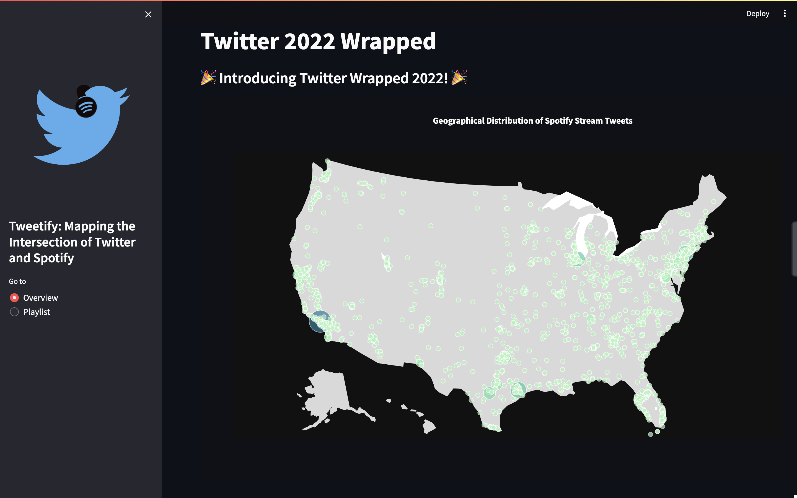
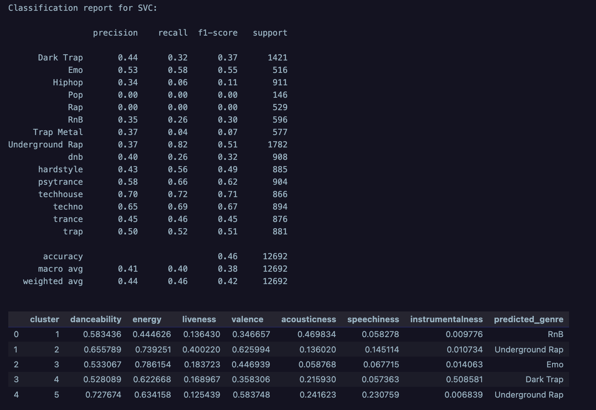

# Tweetify: Mapping the Intersection of Twitter and Spotify 

**Author**: Kat L., University of California, Los Angeles (UCLA)

> **Keywords:** Social Media Analytics, Sentiment Analysis, Natural Language Processing, Unsupervised Learning, Music Information Retrieval 

## Interactive Website 




to run the website, run the following command via terminal: `streamlit run src/app.py`

## Abstract

The nexus of music information retrieval and natural language processing along with the integration of social media and music streaming platforms has emerged as a focal point of research. This study navigates through both Twitter and Spotify to decode contemporary music consumption trends, employing a methodological framework that encompasses data extraction and processing from Twitter, Spotify, and Billboard. Through techniques such as Natural Language Processing and Machine Learning, the study meticulously dissects the auditory preferences reflected in Spotify track shares on Twitter, utilizing unsupervised learning to discern distinct musical clusters and exploring data-driven curation of music. In the wake of analyzing auditory features, sentiment scores, and employing classification models, the investigation highlights the complexities and potential overlaps inherent in musical features, revealing challenges in precise genre classification. Despite these challenges, the exploration unveils valuable insights into listener preferences and predominant musical themes, offering avenues for enhancing music recommendation systems and providing a foundation for future research in understanding and categorizing various musical moods and characteristics. This exploration is pivotal in not only enriching our comprehension of music consumption patterns but also in illuminating the sociocultural and emotional contexts enveloping these patterns, thus bridging the gap between technological advancements and musical ethnography. Future research trajectories may encompass model optimization, multi-label classification, dynamic temporal analysis, and an exploration of the intersectionality of music with various sociocultural and psychological domains.

## Introduction 

The intersection of social media and music streaming platforms has emerged as a significant area of interest in the field of music information retrieval and natural language processing. Social media platforms like Twitter have become a hub for music sharing and discussion, with users frequently sharing tracks from Spotify and other music streaming services[^1^]. This integration has resulted in a wealth of data that can be harnessed to understand contemporary music consumption trends and preferences[^2^]. Additionally, it enables a multi-faceted exploration into not only the musical and auditory preferences of users but also the sociocultural and emotional contexts in which these preferences are embedded. Researchers have previously unraveled the complex layers of music preferences through an analysis of Spotify audio features[^3^]. In a similar vein, microblogs have also offered insights into artist similarity, cultural listening patterns, and even typical listening patterns[^4^]. 

Thus, this project aims to further dissect these dynamics by employing techniques such as Natural Language Processing and Machine Learning to extrapolate industry-wide patterns or anomalies in order to enrich our understanding of contemporary music consumption trends.

## Objectives and Scope of Study 

The primary objective of this study is to understand the dynamics of music consumption patterns reflected through Twitter data, particularly the links to tracks shared from Spotify, employing techniques such as Natural Language Processing and Machine Learning. 

1. **Examine** the auditory preferences reflected through the genres and audio features of shared tracks on Twitter.
   
2. **Utilize** unsupervised learning techniques like K-Means clustering to identify distinct genre-based musical clusters within the tweeted Spotify tracks.
   
3. **Create** a sonically representative playlist for the year 2022 using the data on shared tracks by Twitter users and explore the data-driven curation of music.
   
4. **Assess** the prominence of specific audio features in shared tracks and compare these trends with those in the broader music industry as reflected through Billboard charts. This comparison could unveil industry-wide patterns or anomalies, which could help enrich understanding regarding contemporary music consumption trends.

## Methodology 

This investigation methodology is delineated in 6 main steps below:

1. Twitter Data Extraction
2. Spotify Data Acquisition and Processing
3. Billboard Data Acquisition and Processing
4. Exploratory Data Analysis (EDA)
5. Cluster Analysis 
6. Result Interpretation 


### 1. Twitter Data Extraction

- **Data Source:** The primary dataset of this study consists of tweets retrieved using the `snscrape` tool. This tool was configured to scrape tweets within the year 2022 that contained links to tracks on Spotify.
  
- **Search Configuration:** The `snscrape` parameters were set to focus on tweets containing "open.spotify.com/track" and were geographically constrained to the USA. The search period was fine-tuned for each month within 2022.

- **Data Fields:** The extracted data encapsulates:
  - `username`: User's Twitter handle.
  - `date`: Tweet's timestamp.
  - `rawContent`: Tweet content.
  - `friendsCount`, `followersCount`: User's social connections at the tweet time.
  - `replyCount`, `retweetCount`, `quoteCount`: Tweet's engagement metrics.
  - `place`: Geographical data.
  - `outlinks`: External links in the tweet.

Post-extraction, the dataset was processed using `jq` to create a JSON output (stored in `us_tweets.json`) that captured users for subsequent analysis.

### 2. Spotify Data Acquisition and Processing

- **API Integration:** The Spotify API was harnessed to obtain detailed data about tracks, encompassing auditory features, lyrical content, and associated genres.

- **Track Processing:** Tracks were identified using URIs, and their respective audio features were extracted. Further, the Spotify API was employed to discern track-specific details, such as popularity, artist, song name, and album name.

- **Lyrics Analysis:** Lyrics for each track were sourced using the Genius API, subsequently undergoing text processing to derive unique words while filtering out stop words and non-dictionary terms.

- **Genre Classification:** The Spotify API was once again engaged to recognize the specific subgenres associated with each track.

### 3. Billboard Data Acquisition and Processing

- **Web Scraping:** Data delineating the top songs was scraped from the official Billboard website's "Year-End Hot 100 Songs" section via the `BeautifulSoup` library.

- **Data Format:** The data was structured in `.csv` format, containing rank, song title, artist, and the song's Spotify URL.

- **Data Processing:** The extracted data underwent processing analogous to the Spotify dataset. This uniformity ensures that the data is consistent across both datasets, rendering the analysis more robust.

### 4. Exploratory Data Analysis (EDA)
- Various statistical techniques were employed to inspect, comprehend, and derive insights from the dataset.
- Measures of central tendency and variability like mean and standard deviation were used to encapsulate the general trends and dispersion in musical attributes.
- Data quality and integrity was ensured by examining for possible anomalies, outliers, or inconsistencies that could potentially skew subsequent analyses.

#### Data Visualiztion Descriptions
- **Treemap Visualizations:** Enable the identification and visual representation of prevailing lyrical themes, separated into overall, positive, and negative contexts, facilitating an understanding of prevalent lyrical sentiments.
- **Genre Bar Chart:** Depicts the top 25 music genres, offering a visual representation of collective genre preferences and popularities.
- **Audio Feature Radar Chart:** Provides a comprehensive view of the average values of various audio attributes, allowing a snapshot into the general musical characteristics of the dataset.
- **Audio Heat Map:** Visualizes correlations between different audio attributes, offering insights into potential relationships and dependencies among them.
- **Tempo and Key Distributions:** Showcase the spread of tempo and musical keys within the dataset, indicating common rhythmic and harmonic choices.
- **Popularity and Year Distributions:** Illustrate the distribution of popularity scores and release years of tracks, respectively, offering insights into listener preferences and temporal trends in music.
- **Geolocation Bubble Map:** Visualizes geographical data, highlighting potential regional preferences or trends in music sharing.

### 5. Cluster Analysis
- **Data Scaling:** `StandardScaler` used to normalize the dataset and ensure that the varying scales of attributes do not impact the analysis.
- **Principal Component Analysis (PCA):** Utilized to reduce the dataset's dimensionality while retaining as much variance as possible, aiding in visualizing high-dimensional data.
- **t-Distributed Stochastic Neighbor Embedding (t-SNE):** Applied for dimensionality reduction, particularly useful for visualizing data clusters in a two-dimensional space.
- **K-Means Clustering:** Employed to partition the dataset into distinct, non-overlapping subsets (or clusters), facilitating the identification of inherent groupings within the data.
- **Silhouette Score Calculation:** Used to evaluate the efficacy of the clustering, providing a measure of how similar an object is to its own cluster compared to other clusters.

### 6. Result Interpretation
- **Comparative Analysis:** This was aimed at understanding the underlying patterns, similarities, and disparities within the music data.
- **Musical Attributes Analysis:** Engaged in a comparative study of musical attributes from different platforms (e.g., Twitter vs. Billboard) to discern patterns and tendencies in musical consumption across them.
- **Statistical Testing:** Employed Mann-Whitney U Tests and correlation analyses to validate observed patterns and determine statistical significance.
- **Genre Analysis:** Investigated the genre distribution to understand prevailing musical styles and their respective popularity on different platforms.
- **Discussion:** Synthesized results to derive insights into musical preferences, emotional expressions, correlational dynamics, and genre popularity, providing a thorough understanding of the observed musical landscapes.

## Results and Discussion 

### Sentiment Analysis
- **Predominant Positivity:** The recurring word "love" infers a prevalent positive sentiment.
- **Negative Themes:** Words like "leave" and "die" are notable, possibly indicating the exploration of themes such as loss or struggle.
- **Varied Lyrical Themes:** The co-existence of positive and negative words showcases a variety of lyrical themes, spanning love, friendship, loss, and struggle.

### Audio Feature Analysis 
- **Balanced Energy and Danceability:** Moderation in energy (63.53) and danceability (59.46) might reflect a balance between upbeat and relaxed tracks in listener preferences.
- **Vocal Preference:** A relatively low instrumentalness (8.02) might indicate a consumer preference towards vocal-centric compositions.
- **Acoustic Elements:** Elevated acousticness (23.94) points to a possible inclination towards acoustic or semi-acoustic arrangements in music selections.
- **Tempo Diversity:** Mean tempo is around 121 BPM, which is typical for many dance and pop genres, reinforcing the popularity of upbeat tracks in listener preferences. Overall, there is a wide range of tempos from 40 to 220 BPM, indicating a diverse selection of tracks.
- **Popularity Distribution:** The average popularity is around 44, indicating a moderate level of mainstream appeal in the dataset. The spread of the popularity, with a standard deviation of approximately 26, shows a wide range of songs from less known to hits.
- **Key Distribution:** The most common key is C#/D flat major, which may suggest a preference for songs with a somewhat somber or melancholic tone, as this key is often associated with such emotions in music theory. However, the distribution of keys is relatively even, with no key being significantly more common than others.
- **Year Distribution:** The mean year is 2012, with a 25th percentile at 2009 and a 75th percentile at 2022, showing a concentration of newer songs. This may indicate a preference for more recent music, which is consistent with the popularity of Spotify. 

### Cluster Analysis 

1. **Cluster 1:** May represent mellow or down-tempo genres, given its moderate danceability and high acousticness, juxtaposed with low energy and valence.
2. **Cluster 2:** Likely encapsulates lively, energetic genres like pop or dance, with high danceability, energy, liveness, and valence.
3. **Cluster 3:** Potentially represents energetic electronic genres, with high energy, and moderate valence and danceability.
4. **Cluster 4:** May encompass instrumental or electronic genres, given its moderate danceability and energy, alongside high instrumentalness.
5. **Cluster 5:** Could represent vocally-dominant genres like rap or hip-hop, due to its high danceability, valence, and particularly, speechiness.


#### Implications:

- Different clusters likely represent varied musical moods or genres, providing a structured insight into user preferences and offering potential utility in recommending similar tracks.

### Unsupervised Model Analysis


#### RandomForestClassifier

- **Model Performance:** Demonstrates an accuracy of approximately 49%, reflecting potential challenges in precisely classifying genres.

#### SVC 

- **Model Performance:** Exhibits an accuracy of about 46%, revealing similar challenges in genre classification.

#### Implications:
- The accuracy scores highlight the complexity and potential overlap inherent in musical features, and the challenges in defining clear genre classifications.

### Comparative Analysis Billboard vs. Twitter

#### Descriptive Statistics
- **Twitter:** Mean values indicate a preference for tracks with moderate danceability (0.611), energy (0.636), and valence (0.473), with a notable skew towards non-instrumental tracks (mean instrumentalness: 0.079).
- **Billboard:** Conversely, tracks tend to showcase slightly higher danceability (0.671) and valence (0.545), with an even lower inclination towards instrumentalness (mean: 0.000284).

#### Significance Testing
- **Mann-Whitney U Test:** Pointed towards significant differences in danceability (p < 0.001), valence (p = 0.003), and instrumentalness (p < 0.001) between the two platforms, indicating disparities in listener preference or artist selection in these attributes.

#### Correlation Analysis 
- **Spearman Rank Correlation:** Coefficients revealed subtle differences in the relationships between musical attributes across the two platforms. For instance, energy and acousticness displayed a notably strong negative correlation on Twitter (-0.568) compared to Billboard (-0.459).

#### Genre Distribution 
- Distinct preferences in genre distribution were noted, with "rap" and "pop" consistently featuring in the top genres across both platforms, albeit with different rankings.

#### Implications:
1. **Divergent Listening Behaviors:**
  - Discrepancies in musical attributes (e.g., danceability, valence) between Twitter and Billboard highlight variances in listening and sharing behaviors across platforms.
  - Billboard's elevated danceability and valence may signal a mainstream preference for upbeat, positive tracks, contrasting with the broader array of tracks shared on Twitter.

2. **Musical Composition Insights:**
  - Correlation differences in musical attributes, such as energy and acousticness, between platforms hint at distinct compositional trends.

3. **Genre Popularity Disparities:**
  - Despite "rap" and "pop" being popular across both platforms, variations in rankings and subsequent genres indicate differentiated genre popularity and representation.
  - Twitter’s genre distribution might mirror individualized user preferences, while Billboard could reflect more generalized or mainstream tastes.

## Recommendations for Future Research

1. Model Optimization 
   - Investigate the deployment of hybrid machine learning models, which may encompass both traditional machine learning and deep learning algorithms, to address the nuanced and multi-dimensional nature of music features.
2. Multi-Label Classification 
   - Given the frequent blending of genres in contemporary music, employing multi-label classification models could provide a more accurate representation of tracks that straddle multiple genres.
3. Dynamic Temporal Analysis 
   - Analyze the temporal evolution of music consumption trends and preferences, exploring the impact of external factors such as the COVID-19 pandemic on music consumption patterns.
4. Industry Applications
   -  Insights derived could inform artists, producers, and record labels about prevailing trends, guiding music creation, production, and marketing strategies.
   -  Marketers and advertisers might leverage understanding of music consumption trends to tailor advertising campaigns and marketing strategies on platforms like Spotify and Twitter.
5. Interdisciplinary Exploration
   -  Explore the intersection of music and other fields such as psychology, sociology, and anthropology, to understand the sociocultural and emotional contexts in which music consumption patterns are embedded.
6. Ethical and Bias Considerations
   -  Examine the potential for bias in the data and models, and the ethical implications of the insights gleaned, to ensure responsible and equitable use of the data and models. 

## Repository Structure
```bash 
├── data # data used in the project
│   ├── processed # processed data for analysis/modeling 
│   │   ├── audio-feat 
│   │   ├── billboard
│   │   ├── clusters
│   │   ├── genres
│   │   ├── location
│   │   ├── lyrics
│   │   ├── track-info
│   │   └── train 
│   └── raw # raw data for project 
├── docs
│   └── stopwords.txt # to filter words not significant for analysis  
├── notebooks # notebooks for data analysis and modeling 
│   └── tweetify.ipynb
└── src # source code for project 
    ├── __init__.py
    ├── app.py # streamlit app for visualizations 
```


## References 

[^1^]: Watanabe, K., & Goto, M. (2020). Lyrics information processing: Analysis, generation, and applications. In _Proceedings of the 1st Workshop on NLP for Music and Audio (NLP4MusA)_ (pp. 6-12).
[^2^]: Dawson Jr, C. E., Mann, S., Roske, E., & Vasseur, G. (2021). Spotify: You have a Hit!. _SMU Data Science Review, 5(3)_, 9.

[^3^]: Duman, D., Neto, P., Mavrolampados, A., Toiviainen, P., & Luck, G. (2022). Music we move to: Spotify audio features and reasons for listening. _Plos one, 17(9)_, e0275228.

[^4^]: Schedl, M., & Hauger, D. (2012, April). Mining microblogs to infer music artist similarity and cultural listening patterns. In _Proceedings of the 21st International Conference on World Wide Web_ (pp. 877-886).
